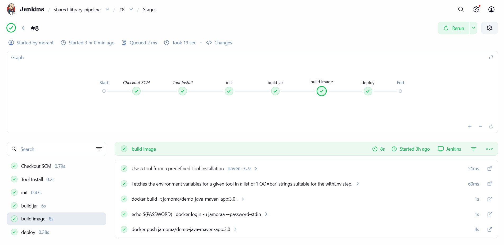

# Demo Project

## 📌 Overview
Create a Jenkins Shared Library

---

## 🛠 Technologies Used
- Jenkins
- Groovy
- Docker
- Git
- Java
- Maven

---

## 📖 Project Description
Create a Jenkins Shared Library to extract common build logic:
- Create separate Git repository for Jenkins Shared Library project
- Create functions in the JSL to use in the Jenkins pipeline
- Integrate and use the JSL in Jenkins Pipeline (globally and for a specific project in Jenkinsfile)

---

## 🌐 Live Demo
The Jenkins server is deployed using Yandex Cloud:

http://158.160.170.10:8080/

> ⚠️ Note: The address may be temporarily unavailable if the cloud server is inactive (for example, if the hosting service has not been paid).

Check the Jenkinsfile in the https://github.com/jamorAA/ci-pipeline-jenkins github repository and feature/jenkins-shared-library branch that using this shared library

---

## 📸 Screenshots

